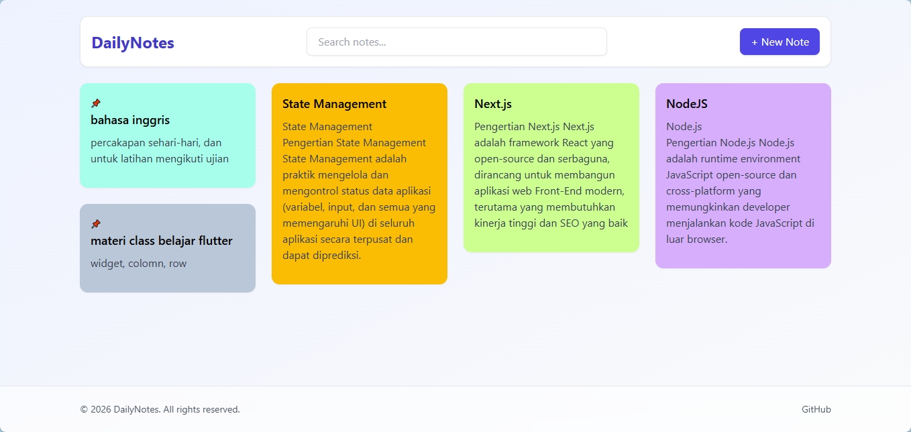
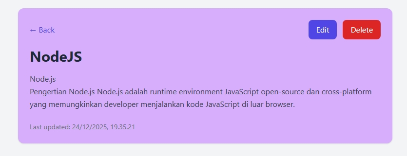
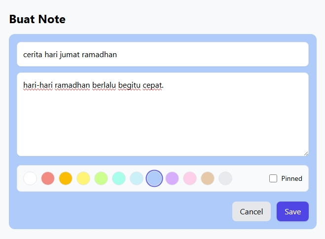
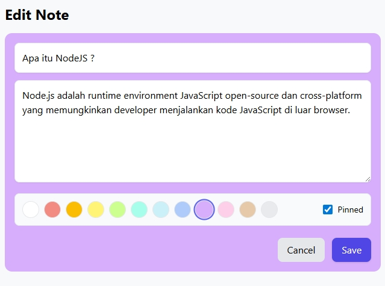
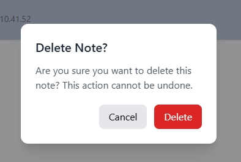

# 📝 DailyNotes — Fullstack Notes App  
DailyNotes adalah aplikasi pencatatan sederhana dibuat sebagai proyek portfolio fullstack.

Aplikasi ini dibangun menggunakan:
- **Frontend:** Next.js + TailwindCSS  
- **Backend:** Node.js + Express + PostgreSQL + Sequelize  

---

## 📸 Preview Aplikasi

## 🌐 Tampilan Utama & Detail

| Homepage | Detailpage |
| :---: | :---: |
|  |  |

---

## 📝 Manajemen Data (CRUD)

<p align="center">
  
  
  
</p>

<p align="center">
  <i>Kiri ke kanan: Form Tambah, Form Edit, dan Konfirmasi Hapus.</i>
</p>

---

## ✨ Features
- Create Note
- Read 
- Edit Note
- Delete Note
- Search Notes
- Colorful UI 
- Responsive & modern design

---

## 🛠 Tech Stack

### Frontend
- Next.js (App Router)
- TailwindCSS
- React / Fetch API

### Backend
- Node.js
- Express.js
- PostgreSQL
- Sequelize ORM

---

## ⚙️ Installation
---

## 📦 Install Backend
```

cd backend
npm install
npm run dev

```
Backend berjalan di:
```
[http://localhost:5000](http://localhost:5000)

```

---

## 🖥 Install Frontend
```

cd frontend
npm install
npm run dev

```
Frontend berjalan di:
```
[http://localhost:3000](http://localhost:3000)

```

---

## 🔧 Environment Variables

### Backend `.env`
```
DB_NAME=dailynotes_db
DB_USER=postgres
DB_PASSWORD=your_password
DB_HOST=127.0.0.1
PORT=5000

```

### Frontend `.env.local`
```
NEXT_PUBLIC_API_URL=[http://localhost:5000/api](http://localhost:5000/api)

```

---

## 📂 Project Structure
```
dailynotes/
│── backend/
│── frontend/
└── README.md

```

---

## 📌 API Routes

| Method | Endpoint         | Description |
|--------|------------------|-------------|
| GET    | /api/notes       | Get all notes |
| POST   | /api/notes       | Create note |
| GET    | /api/notes/:id   | Detail note |
| PUT    | /api/notes/:id   | Update note |
| DELETE | /api/notes/:id   | Delete note |

---

## Developer Notes
Built with ❤️ for portfolio & study.